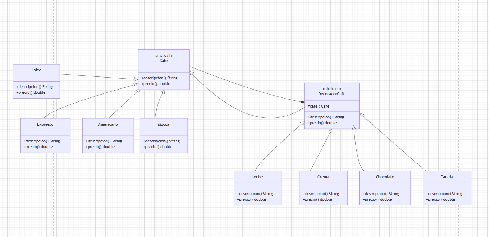

# SAMS CAFE

## Descripción

SAMS CAFE es una aplicación desarrollada en base a una cafeteria rodante, de esta manera simula el proceso de personalización de bebidas en una cafetería utilizando el patrón de diseño **Decorator**.

El sistema permite que le cajero seleccione un tipo de café base y agregar múltiples complementos en base a el pedido del cliente, generando automáticamente una descripción detallada del pedido y el costo total a pagar.

## Objetivo

Implementar el patrón Decorator para agregar funcionalidades dinámicamente a un objeto, permitiendo personalizar bebidas sin modificar las clases originales.

## Patrón de Diseño Utilizado

### Decorator

El patrón Decorator permite añadir responsabilidades a un objeto de manera dinámica.

En este proyecto:

- **Cafe** representa el componente base.
- **Americano, Expresso, Latte y Mocca** son los componentes concretos.
- **DecoradorCafe** es el decorador abstracto.
- **Leche, Crema, Chocolate y Canela** son los decoradores concretos.

Gracias a este patrón, se pueden combinar múltiples complementos sobre una bebida sin crear una clase diferente para cada combinación posible.

---

## Estructura del Proyecto

```
SamsCafe
│
├── src
│   │
│   ├── Bebidas
│   │   ├── Cafe.java
│   │   ├── Americano.java
│   │   ├── Expresso.java
│   │   ├── Latte.java
│   │   └── Mocca.java
│   │
│   ├── Decorator
│   │   └── DecoradorCafe.java
│   │
│   ├── Complementos
│   │   ├── Leche.java
│   │   ├── Crema.java
│   │   ├── Chocolate.java
│   │   └── Canela.java
│   │
│   └── Main.java
│
└── README.md
```

---

## Clases Principales

### Cafe.java

Clase abstracta que define las operaciones comunes para todas las bebidas.

Métodos:

- `descripcion()`
- `precio()`

---

### Bebidas

Representan los cafés base disponibles en el sistema.

| Clase | Descripción | Precio |
|---------|---------|---------|
| Expresso | Café Expresso | S/ 5.60 |
| Americano | Café Americano | S/ 7.80 |
| Latte | Café Latte | S/ 8.50 |
| Mocca | Café Mocca | S/ 10.30 |

---

### DecoradorCafe.java

Clase abstracta que hereda de `Cafe` y mantiene una referencia a la bebida decorada.

Su función es servir como base para todos los complementos.

---

### Complementos

Permiten agregar ingredientes adicionales al café.

| Complemento | Costo |
|-------------|--------|
| Leche | S/ 2.50 |
| Crema | S/ 1.50 |
| Chocolate | S/ 3.40 |
| Canela | S/ 1.80 |

Cada complemento:

- Añade texto a la descripción.
- Incrementa el precio total.

---

### Main.java

Clase principal del sistema.

Funciones:

1. Muestra el menú de cafés.
2. Permite seleccionar una bebida.
3. Permite agregar múltiples complementos.
4. Calcula automáticamente el precio final.
5. Genera una boleta electrónica con el detalle del pedido.

---

## Ejemplo de Ejecución

```
------ SAMS CAFE ------

Seleccione un cafe:

1._ Expresso
2._ Americano
3._ Latte
4._ Mocca

Opción: 4

------ Complementos ------

1._ Leche
2._ Crema
3._ Chocolate
4._ Canela
5._ Finalizar pedido

Opción: 3
Opción: 1
Opción: 5

----- BOLETA ELECTRONICA -----

Pedido: Mocca + chocolate + leche

Total a pagar: 16.2

------------------------------
```

---

## Diagrama 


---
## Autores

Arellys Villena 

ID: 000292454